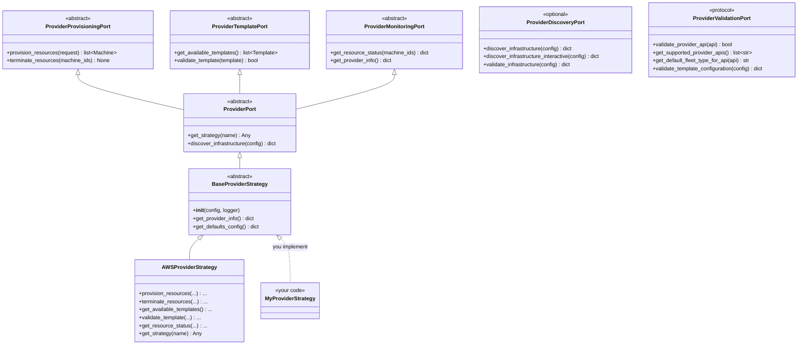

# Adding Support for a New Provider

This guide walks through every change required to integrate ORB with a new
cloud provider. It mirrors the existing reference integration:
**AWS** (`src/orb/providers/aws/`), which currently powers EC2 Fleet,
SpotFleet, AutoScaling Groups, and RunInstances.

A provider integration is the adapter between ORB's domain model
(`Request`, `Machine`, `Template`) and a cloud control plane (EC2, GCE,
Azure VMs, on-prem VM hypervisor, etc.). It is not a scheduler. Schedulers
(under `src/orb/infrastructure/scheduler/`) translate external workload
managers into the domain model. Providers translate the domain model into
cloud API calls and back.

The running example below uses the identifier `myprovider` throughout.
Replace with your own (`gcp`, `azure`, `vsphere`, etc.).

---

## 1. What "Provider Integration" Means in ORB

A provider integration is the cloud-side counterpart to a scheduler. Where
a scheduler translates a workload manager's wire protocol into the domain
model, a provider translates the domain model into cloud API calls.

A provider strategy is responsible for six things:

| Responsibility | What it covers |
|----------------|----------------|
| **Provisioning** | Translate a `Request` into cloud API calls that launch instances. Return domain `Machine` objects. |
| **Termination** | Release resources by `machine_id`. |
| **Status query** | Map cloud-side instance state back into ORB's machine status vocabulary. |
| **Template validation** | Reject domain `Template` objects that name unsupported APIs, image IDs, instance types, or fleet types for this cloud. |
| **Authentication** | Resolve cloud credentials, regions, and accounts on every API call. |
| **Resilience** | Retry transient API faults; classify retryable versus permanent errors; honour rate limits. |

The provider does NOT decide which provider should handle a given request:
that belongs to the provider registry's selection policy
(`ProviderConfig.selection_policy`). The provider does NOT translate
external scheduler protocols: that belongs to schedulers. Keep the
boundaries clean.

---

## 2. Architectural Map

```mermaid
graph LR
    subgraph "Scheduler Layer"
        S["Scheduler strategy<br/>(HostFactory / Default)"]
    end

    subgraph "Application Layer"
        Bus["Command / Query Bus"]
        ProvSvc["ProvisioningOrchestrationService"]
        Sel["ProviderSelectionPort"]
    end

    subgraph "Provider Layer"
        Reg["ProviderRegistry<br/>(MULTI_CHOICE)"]
        Strat["MyProviderStrategy"]
        Handlers["Resource handlers<br/>(per API)"]
        Auth["Auth / session factory"]
        Cloud["Cloud API client"]
    end

    subgraph "Cloud"
        API["MyCloud control plane"]
    end

    S --> Bus
    Bus --> ProvSvc
    ProvSvc --> Sel
    Sel --> Reg
    Reg --> Strat
    Strat --> Handlers
    Handlers --> Auth
    Auth --> Cloud
    Cloud --> API
```



Source layout for the existing AWS reference (use as template) for the files that likely will need to be changed/created:

```
src/orb/providers/
  registration.py                      # Boot-time entry point that registers every provider type with the global registry.
  config_builder.py                    # Helpers that turn a raw config dict into a typed provider configuration object.
  config_validator.py                  # Validates provider configuration before the provider is registered or used.
  results.py                           # Shared envelope objects passed between the registry, strategies, and orchestrators.
  services/                            # Application-level helpers that work across all provider types.
  registry/
    provider_registry.py               # The registry itself: keeps track of every registered provider, returns the right strategy for a given request.
    types.py                           # Data classes describing a registration entry plus error and factory-interface types.
  base/
    strategy/
      base_provider_strategy.py        # The minimal base class every provider strategy inherits from. Stores config and logger and provides default metadata.
      provider_strategy.py             # Defines the strategy contract and the value objects (operation, result, health status, capabilities) used to talk to it.
      fallback_strategy.py             # A wrapper strategy: tries a primary provider, falls back to others when the primary keeps failing.
      composite_strategy.py            # A wrapper strategy: runs an operation across several providers at once (parallel, sequential, aggregated, etc.).
      load_balancing_strategy.py       # A wrapper strategy: spreads requests across multiple providers based on a load-balancing policy.
      load_balancing/                  # The actual load-balancing policies (round-robin, weighted, and others).
      provider_selector.py             # Picks which provider to use next; consumed by the composite and load-balancing wrappers.
      selector_utils.py                # Small helper functions used by the selector.
  aws/
    registration.py                    # Registers the AWS provider with the registry and exposes factories that build its strategy, config, resolver, and validator.
    session_factory.py                 # Creates and configures boto3 sessions, including credentials, region, and timeouts.
    health.py                          # Registers AWS-specific health probes (auth, EC2, DynamoDB) with the shared health-check system.
    profile_discovery.py               # Reads the user's ~/.aws/config to discover named AWS profiles.
    adapters/                          # AWS-specific adapter classes that sit above the infrastructure layer.
    application/                       # AWS use-case services grouped by domain aggregate (machine, request, template, events).
    auth/                              # Authentication strategies (e.g. IAM, Cognito) hidden behind a generic auth port.
    cli/                               # AWS-only CLI subcommands such as infrastructure discovery.
    config/                            # Static configuration files shipped with the AWS provider (defaults, examples).
    configuration/                     # The AWS provider's Pydantic config schema and template-extension configuration.
    domain/                            # AWS-specific value objects and domain helpers (AMI resolver, request aggregates, etc.).
    exceptions/                        # AWS exception classes plus the mapping from boto3 errors into ORB domain errors.
    infrastructure/                    # Low-level AWS code: SDK wrappers, handler factory, per-API handlers, support utilities.
      aws_client.py                    # The single entry point used to call boto3, with retries, error translation, and logging built in.
      aws_client_factory.py            # Builds an AWSClient for a given region or account using the session factory.
      aws_handler_factory.py           # Picks the right handler class based on the API named in the template (EC2Fleet, ASG, SpotFleet, RunInstances).
      adapters/                        # Translate between AWS API shapes and ORB domain objects (machines, templates, status values).
      caching/                         # Caches expensive lookups such as AMI metadata.
      dry_run_adapter.py               # Wraps a handler so AWS validates the call without actually launching anything.
      handlers/                        # One handler per API, each containing the code that turns a template into the right AWS API call.
      instrumentation/                 # Hooks that record metrics and traces around boto3 calls.
      launch_template/                 # Code that creates, versions, and tags AWS Launch Templates.
      services/                        # Focused services used by the strategy: image resolution, instance operations, template validation, etc.
      tags.py                          # Helpers for normalising and merging AWS tag dictionaries.
      template/                        # AWS-specific template helpers used during conversion and validation.
      utils.py                         # Miscellaneous helpers used across the infrastructure layer.
    models/                            # Data transfer objects and model definitions specific to AWS.
    persistence/                       # AWS persistence layer: repositories and queries backed by DynamoDB.
    resilience/                        # AWS retry strategy and the classifier that decides which AWS errors are retryable.
    specs/                             # JSON specs that describe the input each AWS API expects, one folder per API.
    storage/                           # State storage for the AWS provider, including the DynamoDB-backed implementation and unit-of-work helpers.
    strategy/                          # The AWS provider strategy itself, composed from services in the other folders.
    utilities/                         # Small AWS-specific helper utilities (for example EC2 helpers).
    validation/                        # Field-level validators and constraint checks for AWS templates and configuration.
```

`BaseProviderStrategy` provides almost nothing concrete: `__init__`,
`get_provider_info`, and an empty `get_defaults_config()`. Almost every
behaviour is delegated to focused services that the strategy composes,
which is why a real provider expands to dozens of files.

---

## 3. Outline of the Rest of This Guide

The work to add a new provider is grouped into three filesystem zones,
plus verification and reference. Skim this map first, then dive into the
section that matches what you are touching.

| Section | Zone | What you do |
|---------|------|-------------|
| §4 | **The contract** (read-only) | Understand the focused provider ports (`ProviderProvisioningPort`, `ProviderTemplatePort`, `ProviderMonitoringPort`, plus optional discovery and validation). No edits here. |
| §5 | **New code in your provider module** (`src/orb/providers/<myprovider>/`) | Create the package: strategy, configuration schema, auth, handlers, adapters, persistence, resilience, exceptions, image / spec resolution, services. |
| §6 | **Existing infrastructure files you modify** | Wire your provider in: add a `register_<myprovider>_provider()` to `providers/registration.py`, extend `register_all_provider_types()`, register provider services in `bootstrap/provider_services.py`, optionally extend the configuration schema. |
| §7 | **Cross-cutting concerns** | Provider selection and fallback, multi-instance providers, the configuration surface, testing across moto-like mocks versus real cloud. |
| §8 | **Verification** | Contract tests (provisioning, monitoring, template, validation), parametric harness, mocked-cloud and real-cloud integration tests. |

Rule of thumb: §5 is "files only your provider owns", §6 is "files shared
across all providers". If you find yourself editing a file under any other
provider's directory, stop, you are violating the bounded context.

---

## 4. The Provider Port Contract

Every provider integration is a concrete subclass of
`BaseProviderStrategy`, which implements the composite `ProviderPort`.
Source of truth: `src/orb/domain/base/ports/provider_port.py`. The
contract is split across five focused interfaces; concrete strategies
inherit them all through `BaseProviderStrategy`.

The HostFactory and AWS reference implementations are the canonical
references. Skim the AWS strategy at
`src/orb/providers/aws/strategy/aws_provider_strategy.py` once before §5;
do not edit it.



### 4.1 Provisioning

| Method | Purpose | Required? |
|--------|---------|-----------|
| `provision_resources(request: Request) -> list[Machine]` | Translate the `Request` into cloud API calls. Return one domain `Machine` per launched instance, populated with `machine_id`, `instance_type`, `private_ip`, `status`, `provider_data`. | Yes (abstract) |
| `terminate_resources(machine_ids: list[str]) -> None` | Release resources by ID. Idempotent: terminating an already-terminated ID must not raise. | Yes (abstract) |

### 4.2 Templates

| Method | Purpose | Required? |
|--------|---------|-----------|
| `get_available_templates() -> list[Template]` | Enumerate templates the provider knows about. Most providers return the templates already stored in the template repository, optionally filtered to those whose `provider_api` this provider supports. | Yes (abstract) |
| `validate_template(template: Template) -> bool` | Reject templates that reference unsupported APIs, regions, instance types, or images. Return `True` if the template can be provisioned. | Yes (abstract) |

### 4.3 Monitoring

| Method | Purpose | Required? |
|--------|---------|-----------|
| `get_resource_status(machine_ids: list[str]) -> dict[str, Any]` | Look up current cloud-side state per machine. Return a mapping `machine_id -> {"status": <domain status>, ...}` using ORB's domain status vocabulary, not the cloud's raw codes. | Yes (abstract) |
| `get_provider_info() -> dict[str, Any]` | Return provider metadata (type, version, capabilities). | Yes (abstract on `ProviderMonitoringPort`; base default at `BaseProviderStrategy.get_provider_info` returns `{"type": class_name, "config": self.config}`, override only when you want to expose more) |

### 4.4 Discovery (optional)

| Method | Purpose | Required? |
|--------|---------|-----------|
| `discover_infrastructure(config) -> dict` | Passive scan of cloud resources matching the config (subnets, security groups, AMIs). | No (base default returns `{"error": "Infrastructure discovery not supported"}`) |
| `discover_infrastructure_interactive(config) -> dict` | Same, but may prompt the user during CLI runs. | No (base default returns the same error envelope) |
| `validate_infrastructure(config) -> dict` | Validate discovered infrastructure against ORB requirements. | No (base default returns `{"error": ...}`) |

A provider that supports `orb infrastructure discover` must override these
three methods. Most do not; AWS does (see
`src/orb/providers/aws/services/infrastructure_discovery_service.py`).

### 4.5 Validation (Protocol, not ABC)

`ProviderValidationPort` is a `typing.Protocol`; implementing class is a
duck-typed contract enforced by structural typing rather than inheritance.
Required to participate in template validation routing.

| Method | Purpose | Required? |
|--------|---------|-----------|
| `validate_provider_api(api: str) -> bool` | Does this provider support the named API (`"EC2Fleet"`, `"GCE_InstanceGroup"`, etc.)? | Yes (protocol member) |
| `get_supported_provider_apis() -> list[str]` | Enumerate supported APIs. | Yes |
| `get_default_fleet_type_for_api(api: str) -> str` | Default allocation mode when a template does not specify one. | Yes |
| `get_valid_fleet_types_for_api(api: str) -> list[str]` | Allowed allocation modes per API. | Yes |
| `validate_fleet_type_for_api(fleet_type: str, api: str) -> bool` | Compatibility check used during template validation. | Yes |
| `validate_template_configuration(config: dict) -> dict` | Full per-field validation; returns `{"valid": bool, "errors": list[str]}`. | Yes |
| `get_provider_type() -> str` | Stable identifier for the provider (`"aws"`, `"myprovider"`, etc.) used by validation routing. | Yes (protocol member) |

`ProviderValidationPort` is a `typing.Protocol`, satisfied by
structural typing. For convenience, ORB also ships
`BaseProviderValidationAdapter` (in
`src/orb/domain/base/ports/provider_validation_port.py`), an ABC that
provides a working default for `validate_template_configuration`.
Concrete providers usually subclass the ABC rather than reimplement
the protocol from scratch; AWS does this in `AWSValidationAdapter`
(in `src/orb/providers/aws/infrastructure/adapters/aws_validation_adapter.py`),
which implements the contract against a static `_HANDLER_CONFIG`
table.

### 4.6 Composite operations

`ProviderPort.get_strategy(strategy_name)` is the only method on the
composite port itself. Most providers return the strategy registered by
name in their internal handler factory.

---

## 5. New Code in Your Provider Module

> **Zone.** Files you create under `src/orb/providers/<myprovider>/`.
> This is your bounded context. Nothing in this section touches code
> owned by other providers or by the shared infrastructure.

The running example builds out a `myprovider` integration backed by a
hypothetical "MyCloud" REST API.

### 5.1 Create the package

A real provider expands to dozens of files. The skeleton below contains
the entries the contract harness expects (`P` = required, satisfies
`tests/providers/contract/base_*_contract.py`) and a small set of
recommended extras (`R` = recommended, hardening or operational
ergonomics). Add anything beyond this tree only when your cloud
genuinely needs it.

```
src/orb/providers/myprovider/
  __init__.py                              (P)  Module marker; exports the strategy class.
  registration.py                          (P)  register_myprovider_provider() and the create_* factories the registry expects.
  configuration/
    __init__.py                            (P)
    config.py                              (P)  Pydantic provider config used by create_myprovider_config().
  strategy/
    __init__.py                            (P)
    myprovider_strategy.py                 (P)  Concrete subclass of BaseProviderStrategy implementing the three focused ports.
  infrastructure/
    __init__.py                            (P)
    client.py                              (P)  SDK or REST client wrapper that handlers call into.
    adapters/
      machine_adapter.py                   (P)  Translates cloud instance objects into domain Machine objects.
      template_adapter.py                  (P)  Round-trips between Template and the cloud-side template payload.
      validation_adapter.py                (P)  Implements ProviderValidationPort (API allowlist, fleet-type defaults).
    handlers/
      __init__.py                          (P)
      base_handler.py                      (P)  Common provisioning logic shared across APIs.
      <api_name>/
        handler.py                         (P)  Provisioning, termination, and status logic for one API.
        config_builder.py                  (P)  Translates a Template into the API request payload.
      handler_factory.py                   (P)  Maps the template provider_api string to the right handler.
  exceptions/
    myprovider_exceptions.py               (P)  Domain exception hierarchy used to translate cloud SDK errors.
  py.typed                                 (P)  Inline-typed package marker.

  services/                                (R)  Optional convenience services lazily composed by the strategy.
    image_resolution_service.py            (R)  Resolves symbolic image references into concrete IDs; cache-friendly.
    health_check_service.py                (R)  Provider health probes registered with the shared health-check port.
  resilience/                              (R)  Provider-specific retry + classifier; falls back to the shared resilience module if absent.
    retry_strategy.py                      (R)  Retry policy that wraps the cloud SDK calls.
    retry_errors.py                        (R)  Classifier for retryable vs permanent cloud errors.
```

For a single-API cloud, the `<api_name>/` folder under `handlers/` can
be flattened into one `handler.py` plus one `config_builder.py` directly
beneath `handlers/`. A fuller layout (`auth/`, `persistence/`, `specs/`,
`storage/`, `validation/`, `domain/`, `utilities/`) follows the AWS
structure described in §2; add those directories only when the
equivalent AWS feature applies to your cloud. In particular, `auth/` is
only needed when credential resolution is non-trivial. AWS uses the
boto3 credential chain via `session_factory.py` and does not require a
separate `auth/` strategy for the common case.

### 5.2 Configuration (`configuration/config.py`)

Define a `BaseSettings` class (Pydantic plus env-var loading via
`pydantic-settings`) for provider-specific config. This is what the
user puts under `provider.providers[].config` in their config file, and
the same class also resolves overrides from environment variables.

Inherit from both `BaseSettings` and `BaseProviderConfig` so the rest
of ORB recognises the type. Configure `model_config` with the env-var
prefix and nested-delimiter your provider should respond to.

```python
# src/orb/providers/myprovider/configuration/config.py
from typing import Optional

from pydantic import Field
from pydantic_settings import BaseSettings, SettingsConfigDict

from orb.infrastructure.interfaces.provider import BaseProviderConfig


class MyProviderConfig(BaseSettings, BaseProviderConfig):
    """Provider-specific configuration for MyCloud."""

    model_config = SettingsConfigDict(
        env_prefix="MYPROVIDER_",
        env_nested_delimiter="__",
    )

    api_endpoint: str = Field(..., description="MyCloud REST endpoint")
    region: Optional[str] = Field(None, description="Default region")
    project_id: Optional[str] = Field(None, description="Cloud project / tenant ID")
    credentials_file: Optional[str] = Field(
        None, description="Path to JSON credentials file (overrides env)"
    )
    request_timeout_seconds: int = Field(30, ge=1, le=600)
```

With the prefix above, environment variables such as
`MYPROVIDER_API_ENDPOINT`, `MYPROVIDER_REGION`, and
`MYPROVIDER_REQUEST_TIMEOUT_SECONDS` automatically override matching
fields. Nested values use the delimiter, for example
`MYPROVIDER_RETRY__MAX_ATTEMPTS=5`. See
[BaseSetting Providers](basesettings-providers.md) for the full
env-var contract and registration steps.

The shared `ProviderInstanceConfig.config` field (in
`src/orb/config/schemas/provider_strategy_schema.py`) accepts an
arbitrary dict. Your `create_myprovider_config(data: dict) ->
MyProviderConfig` factory parses that dict into the typed object.

In practice, `create_myprovider_strategy` is also called with several
input shapes by different boot paths. Mirror the triage that AWS uses
in `create_aws_strategy` (in `src/orb/providers/aws/registration.py`):
accept an
already-typed `MyProviderConfig` instance, a `ProviderInstanceConfig`
object (extract `.config` and pass it to `MyProviderConfig(**...)`), or
a raw dict. The `create_myprovider_config(data)` factory itself only
needs to handle the raw-dict path.

### 5.3 Authentication (`auth/` and `session_factory.py`)

Wrap credential resolution behind `AuthPort` (or a provider-local
equivalent). Cache short-lived tokens; never cache long-lived secrets in
memory longer than necessary.

A typical implementation:

1. Resolve credentials from the most-specific source first:
   `MyProviderConfig.credentials_file`, then env vars, then a default
   credential discovery mechanism (e.g. application default credentials).
2. Validate by issuing a no-op call to a cheap endpoint (analogous to
   AWS STS `GetCallerIdentity`).
3. Build a session object that downstream handlers pass to the SDK
   client.

Reference: `src/orb/providers/aws/session_factory.py` and
`src/orb/providers/aws/auth/iam_strategy.py`.

### 5.4 SDK client wrapper (`infrastructure/client.py`)

Encapsulate every cloud SDK call behind a single class. Reasons:

- Resilience policies (retry, circuit breaker, timeout) attach in one place.
- Error mapping (cloud SDK exception to domain exception) lives here, not
  scattered across handlers.
- Tests can substitute a mock client without monkey-patching the SDK.

The AWS analogue is the `AWSClient` wrapper at
`src/orb/providers/aws/infrastructure/`.

### 5.5 Strategy class (`strategy/myprovider_strategy.py`)

Subclass `BaseProviderStrategy` and implement the abstract methods from
§4. Do not put cloud-API logic in the strategy; delegate to focused
services. The strategy is wiring.

```python
# src/orb/providers/myprovider/strategy/myprovider_strategy.py
from typing import Any

from orb.providers.base.strategy.base_provider_strategy import BaseProviderStrategy


class MyProviderStrategy(BaseProviderStrategy):
    """Provider strategy for MyCloud."""

    def __init__(self, config: dict[str, Any], logger: Any) -> None:
        super().__init__(config, logger)
        # Lazy services; constructed on first use
        self._instance_service = None
        self._template_service = None
        self._health_service = None

    # 4.1 Provisioning
    def provision_resources(self, request):
        return self._instance_svc().provision(request)

    def terminate_resources(self, machine_ids):
        self._instance_svc().terminate(machine_ids)

    # 4.2 Templates
    def get_available_templates(self):
        return self._template_svc().list_available()

    def validate_template(self, template):
        return self._template_svc().validate(template)

    # 4.3 Monitoring
    def get_resource_status(self, machine_ids):
        return self._instance_svc().status(machine_ids)

    # 4.6 Composite
    def get_strategy(self, strategy_name: str) -> Any:
        return self._handler_factory().get(strategy_name)

    # ... lazy service constructors elided ...
```

Pitfalls to avoid:

- Cloud-side identifiers (instance IDs, fleet IDs) leaving the strategy
  in raw form. Wrap them in domain value objects so downstream code is
  cloud-agnostic.
- Returning machine status using cloud-native vocabulary
  (`PROVISIONING`, `STAGING`, etc.). Always map to the domain
  `MachineStatus` enum.
- Performing API calls during `__init__`. Strategies must construct
  cheaply; deferred service construction makes tests fast.
- Catching every exception and returning empty results. Let domain
  exceptions propagate; the orchestrator handles them.

> Files touched: `myprovider_strategy.py`.

### 5.6 Handlers and handler factory

If the provider offers multiple resource APIs (e.g. EC2 has Fleet, Spot
Fleet, ASG, RunInstances), implement one handler class per API and
dispatch via a factory.

```
infrastructure/
  handler_factory.py              # API name -> handler class (sits at infrastructure/, not handlers/)
  handlers/
    base_handler.py               # BaseProviderHandler ABC; common error mapping + retry hook
    <api_name>/                   # AWS uses asg/, ec2_fleet/, spot_fleet/, run_instances/
      handler.py                  # provision / terminate / status for one API
      config_builder.py           # Template -> API request body
```

If the provider has a single API, the factory is a one-line dispatch and
can be inlined.

Reference: `src/orb/providers/aws/infrastructure/aws_handler_factory.py`
and the four handler subdirectories beneath it.

### 5.7 Adapters (`infrastructure/adapters/`)

Adapters convert between cloud-native shapes and the domain.

| Adapter | Direction | Responsibility |
|---------|-----------|----------------|
| `machine_adapter.py` | cloud `Instance` -> `Machine` | Map status, IPs, tags, image_id, machine_id. Drop fields ORB does not model. |
| `template_adapter.py` | `Template` <-> cloud template payload | Field whitelist (analogous to the `_AWS_SUPPORTED_FIELDS` constant in `aws/infrastructure/adapters/template_adapter.py`); reject unknown fields. |
| `validation_adapter.py` | implements `ProviderValidationPort` | API allowlist, fleet-type defaults, per-field validation. |

Adapters are pure functions over data; they have no I/O.

### 5.8 Image resolution (`services/image_resolution_service.py`)

If the cloud supports symbolic image references (AWS SSM parameters, GCE
image families, Azure image gallery aliases) the provider must resolve
them to concrete IDs before launching. Cache aggressively; image lookups
are slow and rate-limited.

Reference: `src/orb/providers/aws/domain/services/ami_resolver.py` and
`aws/infrastructure/services/aws_image_resolution_service.py`.

### 5.9 Resilience (`resilience/`)

Two recommended files (both marked `(R)` in the §5.1 skeleton):

| File | Responsibility |
|------|----------------|
| `retry_strategy.py` | Subclass the shared `RetryStrategy` (`src/orb/infrastructure/resilience/`). Set per-service max attempts; apply exponential backoff with jitter. |
| `retry_errors.py` | Classify cloud errors into retryable (rate limit, transient I/O) versus permanent (auth failure, validation error). The retry strategy consults this. |

Reference: `AWSRetryStrategy` (in
`src/orb/providers/aws/resilience/aws_retry_strategy.py`) and
`aws/resilience/aws_retry_errors.py`.

### 5.10 Exceptions (`exceptions/myprovider_exceptions.py`)

Translate cloud SDK exceptions to domain exceptions at the lowest layer
where they occur (the SDK wrapper). The SDK wrapper is the canonical
translation boundary; handlers and helper modules that call boto3
directly must perform the same translation rather than re-raise the
SDK type.

Mandatory mappings:

| Cloud category | Domain exception |
|----------------|------------------|
| Authentication / authorization failure | `AuthorizationError` |
| Rate limit / throttling | `RateLimitError` |
| Quota exceeded | `QuotaExceededError` |
| Resource not found | `ResourceNotFoundError` |
| Resource state mismatch | `ResourceStateError` (record current and expected states) |
| Other transient I/O | retain SDK type wrapped as `<MyProvider>Error` extending `InfrastructureError` |

Reference: the full mapping table in `src/orb/providers/aws/exceptions/aws_exceptions.py`.

### 5.11 Health checks (`services/health_check_service.py`)

Register at least one probe per critical dependency. AWS registers three:
STS (auth), EC2 (control plane), DynamoDB (state store). For a cloud
without an external state store, two probes (auth + control plane) are
the floor.

Each probe must return a `ProviderHealthStatus` (Pydantic; defined in
`src/orb/providers/base/strategy/provider_strategy.py`) with the
fields `is_healthy: bool`, `status_message: str`,
`response_time_ms: float`, and optional `error_details`. The probe
must complete within `health_check.timeout` seconds (default 30, set
in `HealthCheckConfig`). The monitoring layer ships a separate
`HealthStatus` envelope (in `src/orb/monitoring/health.py`) used for
system-wide aggregated status; do not confuse the two.

> Files touched: every file under `src/orb/providers/myprovider/`.

---

## 6. Existing Infrastructure Files You Modify

> **Zone.** Files shared across all providers. Edit minimally, only the
> entry points and metadata that wire your provider in. All other content
> in these files belongs to other providers and must not be modified.

### 6.1 Provider registration (`src/orb/providers/<myprovider>/registration.py`)

Each provider ships its own `registration.py` declaring four factories
plus an entry function. Mirror the AWS layout, in particular
`register_aws_provider` (in `src/orb/providers/aws/registration.py`).

```python
# src/orb/providers/myprovider/registration.py
"""MyProvider registration with the provider registry."""

from typing import TYPE_CHECKING, Any, Optional

if TYPE_CHECKING:
    from orb.domain.base.ports import LoggingPort
    from orb.providers.registry import ProviderRegistry


def create_myprovider_strategy(provider_config: Any) -> Any:
    """Strategy factory."""
    from orb.providers.myprovider.configuration.config import MyProviderConfig
    from orb.providers.myprovider.strategy.myprovider_strategy import MyProviderStrategy
    # ... resolve config_data into MyProviderConfig (mirror AWS) ...
    return MyProviderStrategy(config=resolved_config, logger=...)


def create_myprovider_config(data: dict[str, Any]) -> "MyProviderConfig":
    """Config factory."""
    from orb.providers.myprovider.configuration.config import MyProviderConfig
    return MyProviderConfig(**data)


def create_myprovider_resolver(config: Any) -> Any:
    """Reference resolver (image IDs, project IDs, etc.)."""
    from orb.providers.myprovider.services.image_resolution_service import (
        MyProviderImageResolver,
    )
    return MyProviderImageResolver(config)


def create_myprovider_validator(config: Any) -> Any:
    """Validator (implements ProviderValidationPort)."""
    from orb.providers.myprovider.infrastructure.adapters.validation_adapter import (
        MyProviderValidationAdapter,
    )
    return MyProviderValidationAdapter(config)


def register_myprovider_provider(
    registry: "Optional[ProviderRegistry]" = None,
    logger: "Optional[LoggingPort]" = None,
    instance_name: Optional[str] = None,
) -> None:
    """Register MyProvider with the provider registry."""
    if registry is None:
        from orb.providers.registry import get_provider_registry
        registry = get_provider_registry()

    from orb.providers.myprovider.strategy.myprovider_strategy import MyProviderStrategy

    if instance_name:
        registry.register_provider_instance(
            provider_type="myprovider",
            instance_name=instance_name,
            strategy_factory=create_myprovider_strategy,
            config_factory=create_myprovider_config,
            resolver_factory=create_myprovider_resolver,
            validator_factory=create_myprovider_validator,
        )
    else:
        registry.register_provider(
            provider_type="myprovider",
            strategy_factory=create_myprovider_strategy,
            config_factory=create_myprovider_config,
            resolver_factory=create_myprovider_resolver,
            validator_factory=create_myprovider_validator,
            strategy_class=MyProviderStrategy,
        )
```

> Files touched: `src/orb/providers/myprovider/registration.py` (new).

### 6.2 Wire into `register_all_provider_types()`

`src/orb/providers/registration.py` is the boot-time entry point. Add one
import and one call mirroring the AWS line.

```python
# src/orb/providers/registration.py
def register_all_provider_types() -> None:
    from orb.providers.registry import get_provider_registry
    registry = get_provider_registry()

    from orb.providers.aws.registration import register_aws_provider
    register_aws_provider(registry)

    from orb.providers.myprovider.registration import register_myprovider_provider
    register_myprovider_provider(registry)
```

The body around this dict (try/except, fallback wiring, instance-mode
support) must be preserved.

> Files touched: `src/orb/providers/registration.py`.

### 6.3 Bootstrap services (`src/orb/bootstrap/provider_services.py`)

If your provider needs DI-registered services (image resolver, template
adapter, etc.), add a `register_myprovider_services_with_di(container)`
call alongside the AWS one inside `register_provider_services` (in
`src/orb/bootstrap/provider_services.py`). Most providers do not
need this initially; the strategy factory created in §6.1 covers the
common case.

> Files touched: `src/orb/bootstrap/provider_services.py` (only if extra
> DI wiring is required).

### 6.4 Configuration schema

The `ProviderInstanceConfig.type` field (in
`src/orb/config/schemas/provider_strategy_schema.py`) is a free-form
string, not a `Literal`. No schema change is required to register a new
type; the registry resolves it at runtime. Provider-specific keys go
under `ProviderInstanceConfig.config`, validated by `MyProviderConfig`
(§5.2).

If you need to extend `ProviderDefaults` or `CircuitBreakerConfig` at a
global level, edit `src/orb/config/schemas/provider_strategy_schema.py`.
Most providers do not.

> Files touched: `src/orb/config/schemas/provider_strategy_schema.py`
> (only when global defaults change).

---

## 7. Cross-Cutting Concerns

> **Zone.** Topics that span every provider: selection policy, fallback,
> multi-instance support, the user-facing configuration surface, testing
> against mocked versus real clouds.

### 7.1 Selection policy and the registry

The provider registry is a `BaseRegistry` with mode `MULTI_CHOICE`,
selected in `ProviderRegistry.__init__` (in
`src/orb/providers/registry/provider_registry.py`); multiple
providers can be registered simultaneously and one is selected per
request based on `ProviderConfig.selection_policy`.

Selection policies:

| Policy | Behaviour |
|--------|-----------|
| `FIRST_AVAILABLE` (default) | Pick the first provider whose health is `healthy` and whose validation accepts the template. |
| `WEIGHTED_ROUND_ROBIN` | Distribute requests across providers using `ProviderInstanceConfig.weight`. |
| `PRIORITY` | Lower `priority` value wins; ties broken by weight. |

Selection happens through `ProviderSelectionPort`; your provider does
not implement selection itself, only the validation hooks that allow it
to be picked.

### 7.2 Fallback chains

`register_fallback_provider` (in `src/orb/providers/registration.py`)
builds a `FallbackProviderStrategy` that wraps a primary plus N
fallbacks behind a circuit breaker. When the primary fails repeatedly,
traffic shifts to the next fallback for a cooldown window.

A new provider participates in fallback chains automatically once
registered. Test that your provider's exceptions classify correctly so
the circuit breaker opens on the right signal (see §5.10).

### 7.3 Multi-instance providers

A single provider type can be registered as multiple instances (e.g. one
AWS provider per account) by passing `instance_name` to the registration
function (§6.1). User config:

```json
{
  "provider": {
    "selection_policy": "PRIORITY",
    "providers": [
      { "name": "aws-us-east", "type": "aws", "priority": 0,
        "config": { "region": "us-east-1" } },
      { "name": "aws-eu-west", "type": "aws", "priority": 10,
        "config": { "region": "eu-west-1" } },
      { "name": "myprovider-default", "type": "myprovider", "priority": 20,
        "config": { "api_endpoint": "https://api.mycloud.example", "region": "us-central1" } }
    ]
  }
}
```

The strategy factory receives a `ProviderInstanceConfig` and constructs
a per-instance strategy. Cache strategy instances in the registry; the
default `ProviderRegistry` already does this via `_strategy_cache`.

### 7.4 Configuration surface

Once registered, users opt into MyProvider via:

```json
{
  "provider": {
    "selection_policy": "FIRST_AVAILABLE",
    "active_provider": "myprovider-default",
    "providers": [
      {
        "name": "myprovider-default",
        "type": "myprovider",
        "enabled": true,
        "priority": 0,
        "weight": 100,
        "config": {
          "api_endpoint": "https://api.mycloud.example",
          "region": "us-central1",
          "project_id": "orb-prod",
          "credentials_file": "/etc/orb/myprovider-creds.json",
          "request_timeout_seconds": 30
        },
        "capabilities": ["InstanceGroup"],
        "health_check": {
          "enabled": true,
          "interval": 300,
          "timeout": 30,
          "retry_count": 3
        }
      }
    ]
  }
}
```

`orb providers list` picks the new provider up automatically: the
registry is registry-driven, so the CLI surfaces every provider type
that has called `register_provider(...)` at startup.

Environment-variable support comes from BaseSettings (see
[BaseSetting Providers](basesettings-providers.md)). To enable env-var
overrides for `MyProviderConfig`, follow that guide; it is identical
across providers.

### 7.5 Templates and provider validation

The scheduler hands the provider an already-parsed domain `Template`. The
provider does NOT re-parse the wire payload; it only validates that the
template can be provisioned on this cloud. That validation has two
layers:

1. **Static**: `validate_template(template) -> bool` and
   `ProviderValidationPort.validate_provider_api(api)` reject templates
   pointing at unsupported APIs without any cloud round trip.
2. **Dynamic**: at provision time, the handler may discover that the
   referenced AMI / image / instance type is unavailable in the chosen
   region. Raise `ResourceNotFoundError` and let the orchestrator
   surface the error; do not attempt silent fallback.

---

## 8. Verification

> **Zone.** Tests and the PR checklist. Complete these steps after the
> integration runs end-to-end against a real or mocked cloud.

### 8.1 Tests

Test layout: `tests/providers/`. Provider-agnostic contract harnesses
live at `tests/providers/contract/`; per-provider concrete tests live in
sibling directories.

#### 8.1.1 Implement the contract harness

The shared contract base classes are at:

| File | What it pins |
|------|--------------|
| `tests/providers/contract/base_provisioning_contract.py` | `provision_resources` / `terminate_resources` semantics, idempotency. |
| `tests/providers/contract/base_monitoring_contract.py` | `get_resource_status` returns domain status vocabulary. |
| `tests/providers/contract/base_template_contract.py` | `get_available_templates` and `validate_template` correctness. |
| `tests/providers/contract/base_validation_contract.py` | `ProviderValidationPort` API allowlist, fleet-type defaults. |

Mirror the AWS layout:

```
tests/providers/myprovider/contract/
  test_myprovider_provisioning.py     # subclass BaseProvisioningContract
  test_myprovider_monitoring.py
  test_myprovider_template.py
  test_myprovider_validation.py
```

Each subclass provides cloud-mock fixtures and inherits the contract test
methods. The test runner discovers them automatically.

#### 8.1.2 Mocked-cloud integration tests

For AWS, integration tests run against `moto` (in-process AWS mock) at
`tests/onmoto/`. New providers should use the analogous mock library for
their cloud (`responses` for REST, `gcloud-aio-mocks` for GCE, etc.).

Use these tests to cover:

- A full acquire / status / terminate round-trip.
- Cross-region behaviour if applicable.
- Failure modes: rate limit retried, auth failure not retried, quota
  exceeded surfaced as `QuotaExceededError`.

#### 8.1.3 Real-cloud integration tests

Real-cloud tests sit at `tests/onaws/` for AWS. Add `tests/onmycloud/`
following the same pattern. Gate them behind a `--run-mycloud` pytest
flag (mirror `tests/conftest.py`'s `--run-aws` flag) so they do not run
in normal CI.

#### 8.1.4 Coverage target

`pytest --cov=src/orb/providers/myprovider` should show 80%+ on the new
package. Coverage gaps are usually in error-handling branches; the
contract tests in §8.1.1 already exercise the happy path.
