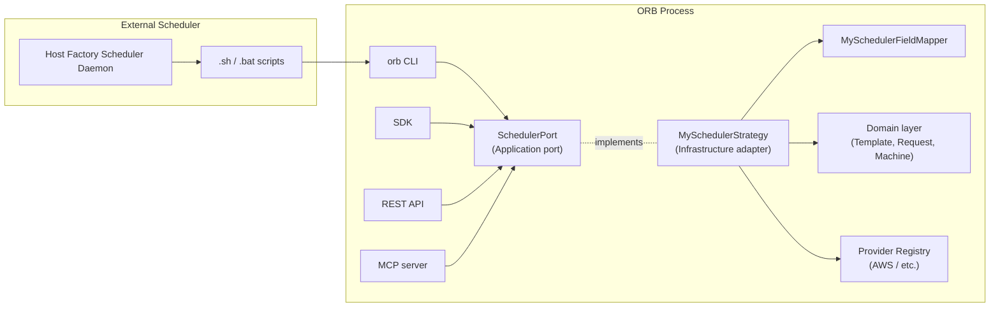
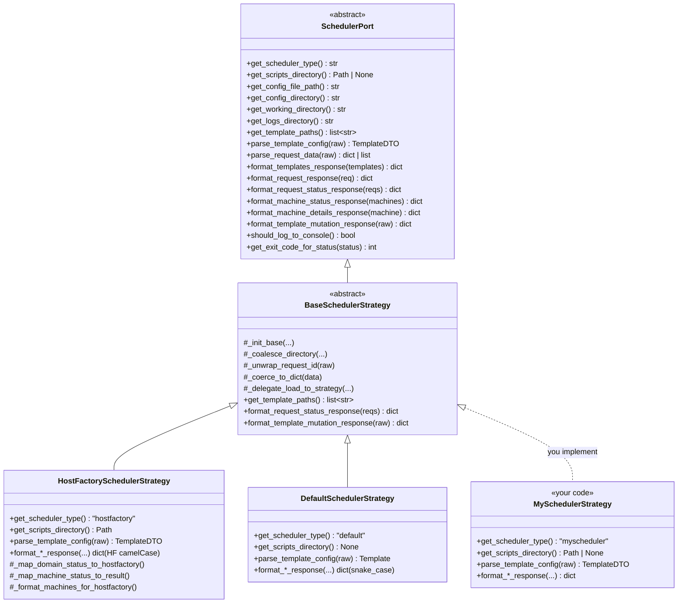
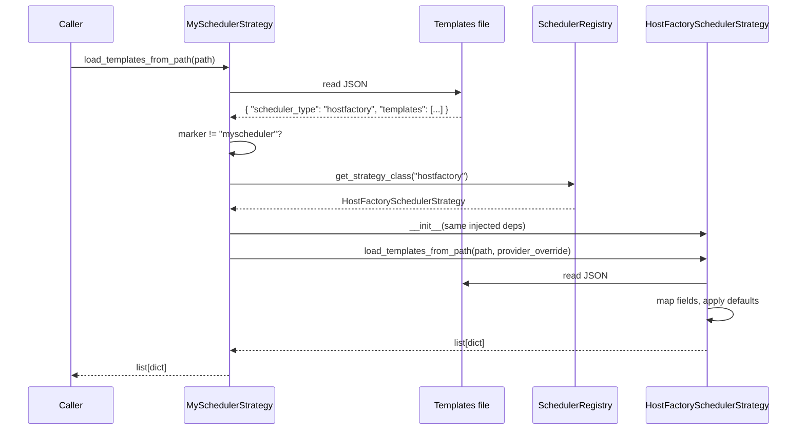

# Adding Support for a New Scheduler

This guide walks through every change required to integrate ORB with a new
workload scheduler. It mirrors the two reference integrations already in the
tree: **HostFactory** (IBM Spectrum Symphony, camelCase wire protocol, daemon,
ships scripts) and **Default** (snake_case domain JSON, interactive, no
scripts).

A scheduler integration is the adapter between an external workload manager's
wire protocol and ORB's internal domain. It is not a provider. Providers (under
`src/orb/providers/`) talk to clouds. Schedulers translate protocol shapes into
ORB's `request -> machine -> template` domain model and back.

> **Audience.** Plugin / contributor developers who already understand ORB's
> clean-architecture layering. If you are new to ORB internals, read
> [Architecture Overview](architecture.md), [Multi-Provider Design](../architecture/multi-provider-design.md),
> and [Field Mapping Architecture](../architecture/field_mapping_architecture.md)
> first.

The running example below uses the identifier `myscheduler` throughout. Replace
with your own.

---

## 1. What "Scheduler Integration" Means in ORB

A scheduler integration is the adapter layer between an external workload
manager's wire protocol and ORB's internal domain. It is not a provider (which
talks to a cloud). It is the protocol shim between an upstream caller and ORB's
`request -> machine -> template` domain model.

A scheduler strategy is responsible for six things:

| Responsibility | What it covers |
|----------------|----------------|
| **Inbound parse** | Parse the scheduler's request payload (template configs, machine requests, status queries, return requests) into the internal domain shape. |
| **Outbound format** | Format ORB domain DTOs (`TemplateDTO`, `RequestDTO`, `MachineDTO`) into the wire format the scheduler expects: field-name casing, status vocabulary, and required envelope fields. |
| **Filesystem layout** | Resolve config / work / logs / scripts directories, including any scheduler-specific environment variables. |
| **Invocation glue** | Provide platform scripts (`.sh` / `.bat`) the scheduler invokes, which delegate to the `orb` CLI. Optional. |
| **Logging policy** | Decide whether logs go to console, file, or both. |
| **Error & exit codes** | Translate domain failures into the scheduler's expected exit codes and error envelopes. |

The scheduler does not decide cloud-side behaviour. That belongs to providers
under `src/orb/providers/`. Keep the boundary clean.

---

## 2. Architectural Map



Source layout for the existing integrations (use as templates):

```
src/orb/
  application/ports/
    scheduler_port.py                    # SchedulerPort: abstract contract every strategy must implement (paths, parsing, formatting hooks)
  infrastructure/scheduler/
    base/
      strategy.py                        # BaseSchedulerStrategy(SchedulerPort, ABC): shared lifecycle, path coalesce, default formatting + abstract get_scripts_directory / get_scheduler_type
      field_mapper.py                    # SchedulerFieldMapper(ABC): bidirectional external↔internal field mapping, output transformation hook for subclasses
    factory.py                           # SchedulerStrategyFactory: builds strategy instances via the registry, with cache + config-manager wiring
    registration.py                      # register_<name>_scheduler() functions wiring concrete strategies into the registry at startup
    registry.py                          # SchedulerRegistry (BaseRegistry, SINGLE_CHOICE) + SchedulerRegistration; resolves scheduler_type → factories
    default/                             # Reference: native domain format
      default_strategy.py                # DefaultSchedulerStrategy: identity strategy, no field mapping, no scripts (returns None), reference impl
      field_mapper.py                    # DefaultFieldMapper: identity mapper (empty field_mappings, no-op input/output)
    hostfactory/                         # Reference: IBM Symphony HostFactory
      hostfactory_strategy.py            # HostFactorySchedulerStrategy: HF wire-format orchestration, template/request/machine formatting, status mapping (all formatter logic inlined here)
      field_mapper.py                    # HostFactoryFieldMapper(SchedulerFieldMapper): per-provider HF camelCase ↔ ORB snake_case mapping with input/output transforms
      field_mappings.py                  # HostFactoryFieldMappings: static registry of HF→ORB field-name maps keyed by provider (generic, aws, …)
      transformations.py                 # HostFactoryTransformations: value-shape transforms (subnetId string → list, user-data file resolution, size limits)
      scripts/                           # IBM HF plugin entry points: invoke_provider.{sh,bat} dispatcher + thin wrappers Symphony exec's by fixed name (requestMachines, getRequestStatus, …)
```

`BaseSchedulerStrategy` already implements directory coalesce
(`_coalesce_directory()` in `base/strategy.py`), default health/system response
shapes, request-id unwrapping (`_unwrap_request_id`), DTO/dict coercion
(`_coerce_to_dict`), and the cross-scheduler load delegator
(`_delegate_load_to_strategy`). Concrete strategies override only what diverges.

---

## 3. Outline of the Rest of This Guide

The work to add a new scheduler is grouped into three filesystem zones, plus
verification and reference. Skim this map first, then dive into the section
that matches what you're touching.

| Section | Zone | What you do |
|---------|------|-------------|
| §4 | **The contract** (read-only) | Understand `SchedulerPort`, the abstract surface every strategy implements. No edits here. |
| §5 | **New code in your scheduler module** (`infrastructure/scheduler/<myscheduler>/`) | Create `field_mappings.py`, `field_mapper.py`, optional `transformations.py`, the strategy class itself, status mapping + logging policy + filename convention (all on the strategy), and optional `scripts/` for external invokers. |
| §6 | **Existing infrastructure files you modify** | Wire your scheduler in: add a `register_<name>_scheduler()` to `registration.py`, register metadata in `registry.py`, extend the `Literal` in `scheduler_schema.py`. |
| §7 | **Cross-cutting concerns** | Cross-loading and the `scheduler_type` marker, provider compatibility, the configuration surface end-to-end. |
| §8 | **Verification** | Tests (parametric harness, contract test, init test, coverage) and PR checklist. |

Rule of thumb: §5 is "files only your scheduler owns", §6 is "files shared
across all schedulers". If you find yourself editing a file under any other
scheduler's directory, stop, you are violating the bounded context.

---

## 4. The `SchedulerPort` Contract

Every scheduler integration is a concrete subclass of `BaseSchedulerStrategy`,
which implements `SchedulerPort`. Source of truth:
`src/orb/application/ports/scheduler_port.py`. Contract is split into five
groups below. Each table notes whether the base class provides a usable
default. The HostFactory and Default strategies under
`src/orb/infrastructure/scheduler/{hostfactory,default}/` are the reference
implementations.



`SchedulerPort` (in the application layer) is the abstract contract.
`BaseSchedulerStrategy` (infrastructure) provides shared lifecycle helpers and
a few permissive default formatters. The two reference subclasses sit at the
bottom; your new `MySchedulerStrategy` joins them as a sibling.

### 4.1 Identity and filesystem layout

| Method | Purpose | Required? |
|--------|---------|-----------|
| `get_scheduler_type() -> str` | Stable identifier (`"hostfactory"`, `"default"`, `"myscheduler"`). Used by registry, on-disk `scheduler_type` markers, config. | Yes (abstract) |
| `get_scripts_directory() -> Path \| None` | Path to platform scripts shipped with the integration, or `None` when the scheduler does not invoke scripts. | Yes (abstract) |
| `get_config_file_path() -> str` | Scheduler-specific config file location. | Yes (abstract) |
| `get_config_directory() / get_working_directory() / get_logs_directory()` | Directory resolution. Base coalesces config override -> scheduler env var -> platform default via `_coalesce_directory()`. Override `_get_scheduler_env_var(suffix)` to honour scheduler-specific vars. | No (base default; override `_get_scheduler_env_var`) |
| `get_log_level() -> str` | Coalesces `scheduler.log_level` -> scheduler env var -> injected logging config -> `"INFO"`. | No (base default) |
| `should_log_to_console() -> bool` | True for interactive schedulers (Default), False for daemons that read stdout (HostFactory). | Yes (abstract) |
| `get_directory(file_type) -> str \| None` | Resolves directory for `"config" / "template" / "log" / "work" / "data" / "legacy"`. | Yes (abstract) |
| `get_storage_base_path() -> str` | Storage base path (`<workdir>/data` by default). | No (base default) |

### 4.2 Template handling

| Method | Purpose | Required? |
|--------|---------|-----------|
| `parse_template_config(raw) -> TemplateDTO` | External wire dict -> internal domain DTO. | Yes (abstract) |
| `format_template_for_display(template) -> dict` | Internal -> wire shape used by `templates list`. | No (base default; `template.to_dict()`) |
| `format_template_for_provider(template) -> dict` | Internal -> shape used internally for provider dispatch. Often identity. | No (base default) |
| `format_templates_response(templates) -> dict` | Wraps a list of templates in the scheduler's response envelope. | Yes (abstract) |
| `format_templates_for_dispatch(templates) -> list[dict]` | Internal -> on-disk / over-the-wire shape (camelCase for HF, snake_case for Default). | Yes (abstract) |
| `serialize_template_for_storage(template_dict) -> dict` | On-disk persistence shape. Base is `format_templates_for_dispatch([t])[0]`. HF overrides to keep unmapped keys (`copy_unmapped=True`). | No (base default; override only if you need to keep unmapped fields) |
| `format_template_mutation_response(raw) -> dict` | Response shape for create / update / delete template ops. | No (base default; snake_case) |
| `get_template_paths() -> list[str]` | Fallback hierarchy: provider-specific filename -> generic provider filename -> `aws_templates.json` -> `templates.json`. | Yes (abstract; base default at `base/strategy.py:308` covers most cases) |
| `get_templates_filename(provider_name, provider_type, config=None) -> str` | Final filename resolution with config-pattern overrides. Override `_templates_filename_pattern_key()` and `_templates_filename_fallback()` per scheduler. | No (base default; `base/strategy.py:345`) |

**Strategy-only method (not on `SchedulerPort`).** `load_templates_from_path` is
not declared on the port; it lives on the concrete strategy (`hostfactory_strategy.py:51`,
`default_strategy.py:60`) and MUST be implemented by every scheduler. It reads
on-disk templates, honours the file's top-level `scheduler_type` marker, and
delegates via `_delegate_load_to_strategy()` (`base/strategy.py:388`) when the
marker differs from `self.get_scheduler_type()`.

```python
def load_templates_from_path(self, path: str, provider_override: str | None = None) -> list[dict]:
    ...
```

### 4.3 Request and machine handling

| Method | Purpose | Required? |
|--------|---------|-----------|
| `parse_request_data(raw) -> dict \| list[dict]` | Inbound parse for `requestMachines`, `getRequestStatus`, `requestReturnMachines`. Must accept every shape the scheduler emits (nested, flat, list, single). | Yes (abstract) |
| `format_request_response(request_data) -> dict` | Response for `requestMachines` and `requestReturnMachines`. Encodes status mapping rules. | Yes (abstract) |
| `format_request_status_response(requests) -> dict` | Response for `getRequestStatus`. | No (base default; passes domain status through unchanged) |
| `format_return_requests_response(requests) -> dict` | **Structurally different.** Per IBM HF 7.3.2, items are flat `{machine, gracePeriod}` pairs, not request-status envelopes. Base default (`base/strategy.py:178`) is permissive and human-readable. | No (base default; permissive) |
| `format_machine_status_response(machines) -> dict` | Response for machine-listing operations. | Yes (abstract) |
| `format_machine_details_response(machine_data) -> dict` | Single-machine response shape. | Yes (abstract) |

### 4.4 Health, system status, exit codes

| Method | Purpose | Required? |
|--------|---------|-----------|
| `format_health_response(checks) -> dict` | Health-check envelope. | No (base default) |
| `format_system_status_response(raw) -> dict` | `system status` output. | No (base default; explicit field extraction) |
| `format_provider_detail_response(raw) -> dict` | Provider detail rendering. | No (base default) |
| `format_storage_test_response(raw) -> dict` | Storage smoke-test response. | No (base default) |
| `get_exit_code_for_status(status) -> int` | Maps domain status (`pending` / `in_progress` / `acquiring` / `complete` / `failed` / `partial` / `cancelled` / `timeout`) to a process exit code. Base returns `1` for `failed / cancelled / timeout / partial`, `0` otherwise. | No (base default) |

### 4.5 Optional defaults contribution

```python
@classmethod
def get_defaults_config(cls) -> dict:
    """Defaults merged into ORB config when this scheduler is registered."""
    return {}
```

`SchedulerRegistry.collect_defaults()` (`registry.py:128`) walks every
registered strategy class and deep-merges these contributions into the loaded
config. Use it sparingly: prefer per-scheduler env vars and the
`_SCHEDULER_EXTRA_CONFIG` entry over silent global defaults.

---

## 5. New Code in Your Scheduler Module

> **Zone.** Files you create under
> `src/orb/infrastructure/scheduler/<myscheduler>/`. This is your bounded
> context, nothing in this section touches code owned by other schedulers
> or by the shared infrastructure.

The running example assumes a JSON wire protocol with SCREAMING_SNAKE_CASE
field names (`TEMPLATE`, `MACHINE_ID`, `REQUEST_ID`) so the casing is distinct
from both reference integrations. Substitute your own scheduler's casing where
needed.

### 5.1 Create the package

```
src/orb/infrastructure/scheduler/myscheduler/
  __init__.py
  myscheduler_strategy.py
  field_mapper.py
  field_mappings.py        # only if mappings are non-trivial
  transformations.py       # only if value-shape changes are needed
  response_formatter.py    # optional, for complex envelope logic
  scripts/                 # only if the scheduler invokes ORB via scripts
    invoke_provider.sh
    invoke_provider.bat
    <each scheduler operation>.sh / .bat
  py.typed
```

Example concrete layout for a `myscheduler` named "fairshare" that does ship
scripts, has provider-specific mappings, but no value-shape transforms:

```
src/orb/infrastructure/scheduler/fairshare/
  __init__.py
  fairshare_strategy.py
  field_mapper.py
  field_mappings.py
  scripts/
    invoke_provider.sh
    invoke_provider.bat
    requestMachines.sh
    requestMachines.bat
    getRequestStatus.sh
    getRequestStatus.bat
  py.typed
```

For comparison, a minimal scheduler with no scripts, no provider-specific
mappings, no value transforms (closest to `default`):

```
src/orb/infrastructure/scheduler/myscheduler/
  __init__.py
  myscheduler_strategy.py
  field_mapper.py
  py.typed
```

> Files touched: new package directory under `src/orb/infrastructure/scheduler/myscheduler/`.

### 5.2 Field mappings (`field_mappings.py`)

If the scheduler uses different field names from the domain, declare them in a
`MAPPINGS` dict split into a `generic` block plus per-provider blocks. Only
provider-specific keys are mapped when that provider is active, so the table
does not leak unsupported fields.

```python
# src/orb/infrastructure/scheduler/myscheduler/field_mappings.py
class MySchedulerFieldMappings:
    """Wire field name -> internal domain field name."""

    MAPPINGS: dict[str, dict[str, str]] = {
        "generic": {
            "TEMPLATE": "template_id",
            "MAX_INSTANCES": "max_instances",
            "INSTANCE_TYPE": "instance_type",
            "IMAGE_ID": "image_id",
            # ...
        },
        # Provider-specific, only mapped when that provider is active.
        "aws": {
            "FLEET_ROLE": "fleet_role",
            "ON_DEMAND_PERCENT": "percent_on_demand",
        },
    }

    @classmethod
    def get_mappings(cls, provider_type: str) -> dict[str, str]:
        return {**cls.MAPPINGS["generic"], **cls.MAPPINGS.get(provider_type, {})}
```

Reference: `HostFactoryFieldMappings` in
`infrastructure/scheduler/hostfactory/field_mappings.py`. Rule: do not leak
provider-specific keys into the generic block.

Worked example. Wire payload in (left), internal payload out (right), with
`provider_type="aws"`:

| Wire (in)        | Internal (out)    |
|------------------|-------------------|
| `TEMPLATE`       | `template_id`     |
| `MAX_INSTANCES`  | `max_instances`   |
| `INSTANCE_TYPE`  | `instance_type`   |
| `FLEET_ROLE`     | `fleet_role`      |
| `ALLOC_STRATEGY` | `ALLOC_STRATEGY`  *(unmapped, kept verbatim)* |

If the same payload arrived with `provider_type="gcp"`, `FLEET_ROLE` is not in
the GCP block, so it stays as `FLEET_ROLE` in the output. That is the safety
net: provider-specific names never silently rename for the wrong cloud.

> Files touched: `field_mappings.py`.

### 5.3 Field mapper (`field_mapper.py`)

Subclass `SchedulerFieldMapper` from
`src/orb/infrastructure/scheduler/base/field_mapper.py`. The base implements
`map_input_fields`, `map_output_fields`, and `format_for_generation` against
`field_mappings`. Override `_apply_output_transformations(mapped)` only for
value-shape changes.

```python
# src/orb/infrastructure/scheduler/myscheduler/field_mapper.py
from orb.infrastructure.scheduler.base.field_mapper import SchedulerFieldMapper
from orb.infrastructure.scheduler.myscheduler.field_mappings import MySchedulerFieldMappings


class MySchedulerFieldMapper(SchedulerFieldMapper):
    def __init__(self, provider_type: str = "aws") -> None:
        self._provider_type = provider_type

    @property
    def field_mappings(self) -> dict[str, str]:
        return MySchedulerFieldMappings.get_mappings(self._provider_type)

    def _apply_output_transformations(self, mapped: dict) -> dict:
        # e.g. join tags dict into "k=v;k=v" string, flatten subnet list.
        return mapped
```

Reference: `HostFactoryFieldMapper` takes a `provider_type` constructor
argument and overrides `map_output_fields` for nested-key support.
`DefaultFieldMapper` is the identity: empty `field_mappings`, no
transformations.

Worked example, full round-trip with `provider_type="aws"`.

Inbound (scheduler wire, in):
```
{
  "TEMPLATE":        "tmpl-prod",
  "MAX_INSTANCES":   5,
  "ALLOC_STRATEGY":  "lowest-price"     // not in MAPPINGS
}
```

After `map_input_fields` (internal, out):
```
{
  "template_id":     "tmpl-prod",
  "max_instances":   5,
  "ALLOC_STRATEGY":  "lowest-price"     // unmapped, copied verbatim
}
```

Outbound (internal, in):
```
{
  "template_id":     "tmpl-prod",
  "max_instances":   5,
  "instance_tags":   {"Env": "prod", "Owner": "team"}
}
```

After `map_output_fields` plus an output transformation that flattens
`instance_tags` from a dict into a `k=v;k=v` string (scheduler wire, out):
```
{
  "TEMPLATE":        "tmpl-prod",
  "MAX_INSTANCES":   5,
  "INSTANCE_TAGS":   "Env=prod;Owner=team"
}
```

Anything heavier than a one-liner output transform belongs in
`transformations.py` (§5.4), not in the mapper.

> Files touched: `field_mapper.py`.

### 5.4 Transformations (optional, `transformations.py`)

For value-shape changes (tag-string parsing, subnet list flattening, instance
type singletons, etc.) put pure functions in `transformations.py` and call
them from the strategy after `map_input_fields`. Idiom:

```python
# src/orb/infrastructure/scheduler/myscheduler/transformations.py
class MySchedulerTransformations:
    @staticmethod
    def apply_transformations(mapped: dict) -> dict:
        if isinstance(mapped.get("subnet_ids"), str):
            mapped["subnet_ids"] = [
                s.strip() for s in mapped["subnet_ids"].split(",") if s.strip()
            ]
        return mapped
```

Reference: `HostFactoryTransformations` in
`infrastructure/scheduler/hostfactory/transformations.py` parses tag strings
(`"k=v;k=v"` -> dict), flattens subnets (string / list / comma-separated -> flat
list), reads `user_data` from disk when the value is a path, and reconciles
`instance_type` with `instance_types`.

> Files touched: `transformations.py`.

### 5.5 Strategy class (`myscheduler_strategy.py`)

The strategy ties everything together. It MUST inherit `BaseSchedulerStrategy`
and implement every abstract method on `SchedulerPort` (§4.1-4.5).

The constructor MUST accept the five injected ports
(`template_defaults_service`, `config_port`, `logger`,
`provider_registry_service`, `path_resolver`). Set
`self._template_defaults_service` BEFORE calling `_init_base(...)`.

```python
# src/orb/infrastructure/scheduler/myscheduler/myscheduler_strategy.py
import os
from pathlib import Path
from typing import Any, TYPE_CHECKING

from orb.infrastructure.scheduler.base.strategy import BaseSchedulerStrategy
from orb.infrastructure.scheduler.myscheduler.field_mapper import MySchedulerFieldMapper
from orb.infrastructure.scheduler.myscheduler.transformations import (
    MySchedulerTransformations,
)
from orb.infrastructure.template.dtos import TemplateDTO

if TYPE_CHECKING:
    from orb.domain.template.ports.template_defaults_port import TemplateDefaultsPort


class MySchedulerStrategy(BaseSchedulerStrategy):
    """Adapter for MyScheduler <-> ORB domain."""

    def __init__(
        self,
        template_defaults_service: "TemplateDefaultsPort | None" = None,
        config_port: Any = None,
        logger: Any = None,
        provider_registry_service: Any = None,
        path_resolver: Any = None,
    ) -> None:
        # Set BEFORE _init_base so cross-load delegation works.
        self._template_defaults_service = template_defaults_service
        self._init_base(
            config_port=config_port,
            logger=logger,
            provider_registry_service=provider_registry_service,
            path_resolver=path_resolver,
        )
        self._field_mapper: MySchedulerFieldMapper | None = None

    # ---- identity ----------------------------------------------------------
    def get_scheduler_type(self) -> str:
        return "myscheduler"

    def get_scripts_directory(self) -> Path | None:
        from orb._package import PACKAGE_ROOT
        return PACKAGE_ROOT / "infrastructure/scheduler/myscheduler/scripts"

    @property
    def field_mapper(self) -> MySchedulerFieldMapper:
        # Lazy init: provider type is unknown at construction time.
        if self._field_mapper is None:
            self._field_mapper = MySchedulerFieldMapper(self._get_active_provider_type())
        return self._field_mapper

    # ---- scheduler-specific env vars (logs/work/config dir overrides) ------
    def _get_scheduler_env_var(self, suffix: str) -> str | None:
        mapping = {
            "CONFIG_DIR": "MYSCHED_CONFIG_DIR",
            "WORK_DIR": "MYSCHED_WORK_DIR",
            "LOG_DIR": "MYSCHED_LOG_DIR",
            "LOG_LEVEL": "MYSCHED_LOG_LEVEL",
            "CONSOLE_ENABLED": "MYSCHED_CONSOLE_ENABLED",
        }
        if env_var := mapping.get(suffix):
            return os.environ.get(env_var)
        return None

    def should_log_to_console(self) -> bool:
        # Mirror HF's decision tree (see §5.7).
        if (
            val := getattr(self.config_manager.app_config.scheduler, "console_enabled", None)
        ) is not None:
            return bool(val)
        if val := self._get_scheduler_env_var("CONSOLE_ENABLED"):
            return val.lower() == "true"
        if self._config_manager is not None:
            return bool(self._config_manager.get_logging_config().get("console_enabled", False))
        return False  # daemon default; switch to True for interactive schedulers

    # ---- inbound parse -----------------------------------------------------
    def parse_template_config(self, raw_data: dict[str, Any]) -> TemplateDTO:
        domain_data = self.field_mapper.map_input_fields(raw_data)
        domain_data = MySchedulerTransformations.apply_transformations(domain_data)
        return TemplateDTO.from_dict(domain_data)

    def parse_request_data(
        self, raw_data: dict[str, Any]
    ) -> dict[str, Any] | list[dict[str, Any]]:
        # Status query
        if "requests" in raw_data:
            requests = raw_data["requests"]
            requests_list = requests if isinstance(requests, list) else [requests]
            return [
                {"request_id": r.get("REQUEST_ID") or r.get("request_id")}
                for r in requests_list
            ]
        # Acquire / return
        return {
            "template_id": raw_data.get("TEMPLATE") or raw_data.get("template_id"),
            "requested_count": raw_data.get("COUNT", 1),
            "request_type": raw_data.get("REQUEST_TYPE", "provision"),
            "metadata": raw_data.get("metadata", {}),
        }

    # ---- outbound format ---------------------------------------------------
    def format_templates_response(self, templates: list[TemplateDTO]) -> dict[str, Any]:
        return {
            "templates": [self.format_template_for_display(t) for t in templates],
            "message": "Templates retrieved successfully",
            "success": True,
            "total_count": len(templates),
        }

    def format_template_for_display(self, template: TemplateDTO) -> dict[str, Any]:
        return self.field_mapper.map_output_fields(template.to_dict(), copy_unmapped=False)

    def format_template_for_provider(self, template: TemplateDTO) -> dict[str, Any]:
        return template.to_dict()

    def format_templates_for_dispatch(self, templates: list[dict]) -> list[dict]:
        return self.field_mapper.format_for_generation(templates)

    def format_request_response(self, request_data: Any) -> dict[str, Any]:
        d = self._coerce_to_dict(request_data)
        request_id = self._unwrap_request_id(d.get("request_id") or d.get("REQUEST_ID"))
        status = d.get("status", "pending")
        return {
            "REQUEST_ID": request_id,
            "STATUS": self._map_domain_status(status),
            "MESSAGE": d.get("message", ""),
        }

    def format_request_status_response(self, requests: list[Any]) -> dict[str, Any]:
        formatted = []
        for r in requests:
            d = r if isinstance(r, dict) else r.to_dict()
            formatted.append(
                {
                    "REQUEST_ID": d.get("request_id"),
                    "STATUS": self._map_domain_status(d.get("status", "pending")),
                    "MACHINES": [
                        {"MACHINE_ID": m.get("machine_id"), "STATE": m.get("status")}
                        for m in (d.get("machines") or d.get("machine_references") or [])
                    ],
                }
            )
        return {"REQUESTS": formatted}

    def format_return_requests_response(self, requests: list[Any]) -> dict[str, Any]:
        # Whatever envelope MyScheduler expects for returns. See HF for the
        # flat {machine, gracePeriod} pattern at hostfactory_strategy.py:563.
        ...

    def format_machine_status_response(self, machines: list[Any]) -> dict[str, Any]:
        return {"MACHINES": [self._serialise_machine(m) for m in machines]}

    def format_machine_details_response(self, machine_data: dict) -> dict:
        ...

    # ---- config & paths ----------------------------------------------------
    def get_config_file_path(self) -> str:
        return self.config_manager.resolve_file("config", "myscheduler_config.json")

    def get_directory(self, file_type: str) -> str | None:
        workdir = self.get_working_directory()
        if file_type in ("config", "template", "legacy"):
            return os.path.join(workdir, "config")
        if file_type == "log":
            return self.get_logs_directory()
        return workdir

    @staticmethod
    def _map_domain_status(domain_status: str) -> str:
        return {"complete": "DONE", "failed": "ERROR"}.get(domain_status, "RUNNING")
```

Pitfalls to avoid:

- Never instantiate the field mapper at class-definition time. The active
  provider type is unknown until the registry has been populated. Use the lazy
  `@property` shown above.
- Always use `_unwrap_request_id()` when extracting request IDs from DTOs,
  dicts, or pydantic objects.
- Use `_coerce_to_dict()` for input that may be a DTO, pydantic model,
  dataclass, or plain dict.
- Set `self._template_defaults_service` BEFORE `_init_base(...)` so the
  cross-load delegate (§7.1) can construct a copy with the same dependencies.

Reference reading:
`infrastructure/scheduler/hostfactory/hostfactory_strategy.py` is the most
thorough example. It shows status mapping
(`_map_domain_status_to_hostfactory()` at `:920`), per-machine result mapping
for acquire vs return (`_map_machine_status_to_result()` at `:897`), the
`attributes` envelope required by IBM HF 7.3.2, and the
`_format_machines_for_hostfactory` shape with `launchtime`, `cloudHostId`, and
`privateIpAddress` invariants.

> Files touched: `myscheduler_strategy.py`.

### 5.6 Status mapping (three sub-mappings)

Three independent mappings deserve careful design. Document the chosen mapping
on the strategy class (constant or method) so reviewers can audit it without
running the code.

**Mapping A: domain status -> scheduler vocabulary.** Domain statuses (eight
values, see `RequestStatus` enum at `domain/request/request_types.py:82`):
`pending`, `in_progress`, `acquiring`, `complete`, `partial`, `failed`,
`cancelled`, `timeout`. `acquiring` is a transitional in-flight status (see
`RequestStatus.is_active()` at `request_types.py:122`); a new scheduler must
either map it explicitly or fold it into its in-flight bucket. HostFactory
collapses every domain status into HF's three-value set
(`running` / `complete` / `complete_with_error`) inside
`_map_domain_status_to_hostfactory()` at `hostfactory_strategy.py:920`. Default
passes them through unchanged.

| Domain status | HostFactory             | Default       | MyScheduler (writer fills) |
|---------------|-------------------------|---------------|----------------------------|
| `pending`     | `running`               | `pending`     |                            |
| `in_progress` | `running`               | `in_progress` |                            |
| `acquiring`   | `running` (default fall-through) | `acquiring` |                       |
| `complete`    | `complete`              | `complete`    |                            |
| `partial`     | `complete_with_error`   | `partial`     |                            |
| `failed`      | `complete_with_error`   | `failed`      |                            |
| `cancelled`   | `complete_with_error`   | `cancelled`   |                            |
| `timeout`     | `complete_with_error`   | `timeout`     |                            |

**Mapping B: per-machine status -> `result` (acquire vs return).** Request
type matters: a `terminated` machine is a *failure* during acquire but a
*success* during return. Reference: `_map_machine_status_to_result()` at
`hostfactory_strategy.py:897`. HF's three-value `result` vocabulary is
`succeed` / `executing` / `fail`.

| Machine status | `request_type="acquire"` | `request_type="return"` |
|----------------|--------------------------|-------------------------|
| `running`      | `succeed`                | `executing`             |
| `pending`      | `executing`              | `executing`             |
| `launching`    | `executing`              | `fail`                  |
| `terminated`   | `fail`                   | `succeed`               |
| `stopped`      | `executing` (default)    | `succeed`               |
| `shutting-down`| `executing` (default)    | `executing`             |
| `stopping`     | `executing` (default)    | `executing`             |
| `terminating`  | `executing` (default)    | `executing`             |
| `failed`       | `fail`                   | `fail`                  |
| `error`        | `fail`                   | `fail`                  |
| (unknown)      | `executing`              | `fail`                  |

**Mapping C: domain status -> process exit code.** The base default
(`base/strategy.py:110`) returns `1` for `failed / cancelled / timeout / partial`
and `0` otherwise. Override `get_exit_code_for_status()` only if MyScheduler
needs finer granularity.

### 5.7 Logging policy

`should_log_to_console()` decision tree (mirrors HF at
`hostfactory_strategy.py:753`):

1. Config override: `scheduler.console_enabled` (when not `None`).
2. Scheduler env var: `MYSCHED_CONSOLE_ENABLED` (case-insensitive `"true"`).
3. Injected logging config: `ORB_LOG_CONSOLE_ENABLED` resolved by
   `_load_from_env`.
4. Hard default: `False` for daemons (HF model), `True` for interactive
   (Default model).

### 5.8 Templates filename convention (optional)

The base default filename pattern is `<provider_type>_templates.json` (key
`"provider_type"` in `filename_patterns`). Override two methods to change it:

```python
def _templates_filename_pattern_key(self) -> str:
    return "provider_specific"   # or any custom key

def _templates_filename_fallback(self, provider_name: str, provider_type: str) -> str:
    return f"{provider_name}_myscheduler_templates.json"
```

HostFactory uses `"provider_specific"` and
`f"{provider_name}_templates.json"`. Default uses `"provider_type"` and
`f"{provider_type}_templates.json"`.

Files written by this scheduler SHOULD include
`"scheduler_type": "myscheduler"` at the top level so cross-loading delegates
correctly (§7.1).

> Files touched: `myscheduler_strategy.py` (override-only).

### 5.9 Platform scripts (`scripts/`)

Skip this section if MyScheduler does not invoke ORB via shell scripts.

For schedulers that do (HF model), ship one `invoke_provider.{sh,bat}` plus
one thin wrapper per scheduler operation. The wrappers are one-liners:

```bash
# requestMachines.sh
#!/bin/bash
export MYSCHED_CALLER_SCRIPT="$(basename "$0")"
"$(dirname "$0")/invoke_provider.sh" machines request "$@"
```

`invoke_provider.sh` itself locates the Python venv, sets `PYTHONPATH`, and
invokes `orb` (or `python -m orb` in development mode). Copy
`infrastructure/scheduler/hostfactory/scripts/invoke_provider.sh` as a
starting point. It already handles:

- `USE_LOCAL_DEV` toggle for dev vs installed-package execution.
- venv activation via `ORB_VENV_PATH`.
- Walking up to `$PROJECT_ROOT` to find `${PACKAGE_ROOT}/run.py`.
- Per-script log file (`scripts.log`) under `MYSCHED_LOGDIR` (rename the env
  var per scheduler).
- Passing `-f <file>` through as a global flag, everything else verbatim.

For each scheduler operation, ship a thin wrapper that maps to the
corresponding `orb` subcommand. The HostFactory mapping is:

| Wrapper script             | `orb` subcommand        |
|----------------------------|-------------------------|
| `getAvailableTemplates.sh` | `templates list`        |
| `requestMachines.sh`       | `machines request`      |
| `getRequestStatus.sh`      | `requests status`       |
| `getReturnRequests.sh`     | `requests list-returns` |
| `requestReturnMachines.sh` | `machines return`       |
| `templateWizard.sh`*       | (no `orb` subcommand)   |

\* `templateWizard.sh` is HF-specific and currently invokes `templateWizard`,
which is not registered as an `orb` CLI subcommand. New schedulers do not need
an analogue. Track upstream before relying on it.

Ship both `.sh` (Unix) and `.bat` (Windows) variants. `orb init` discovers them
via `get_scripts_directory()` and copies them into the user's `scripts_dir`.

The HostFactory reference contains 14 files: 6 operations x `.sh`/`.bat` (12)
plus `invoke_provider.{sh,bat}` (2).

> Files touched: `infrastructure/scheduler/myscheduler/scripts/*` (only if
> MyScheduler invokes ORB via scripts).

---

## 6. Existing Infrastructure Files You Modify

> **Zone.** Files shared across all schedulers. Edit minimally, only the
> entry points and metadata that wire your scheduler in. Everything else in
> these files belongs to other schedulers and must not change.

### 6.1 Registration (`registration.py`)

Add three things to `src/orb/infrastructure/scheduler/registration.py`. Mirror
`create_symphony_hostfactory_strategy` and `create_default_strategy`.

```python
# src/orb/infrastructure/scheduler/registration.py
def create_myscheduler_strategy(config: Any) -> "SchedulerPort":
    from orb.application.services.provider_registry_service import ProviderRegistryService
    from orb.domain.base.ports.configuration_port import ConfigurationPort
    from orb.domain.base.ports.logging_port import LoggingPort
    from orb.domain.base.ports.path_resolution_port import PathResolutionPort
    from orb.domain.template.ports.template_defaults_port import TemplateDefaultsPort
    from orb.infrastructure.scheduler.myscheduler.myscheduler_strategy import (
        MySchedulerStrategy,
    )

    template_defaults_service = None
    config_port = None
    logger = None
    provider_registry_service = None
    path_resolver = None

    if hasattr(config, "get_optional"):
        template_defaults_service = config.get_optional(TemplateDefaultsPort)
        config_port = config.get_optional(ConfigurationPort)
        logger = config.get_optional(LoggingPort)
        provider_registry_service = config.get_optional(ProviderRegistryService)
        path_resolver = config.get_optional(PathResolutionPort)

    return MySchedulerStrategy(
        template_defaults_service=template_defaults_service,
        config_port=config_port,
        logger=logger,
        provider_registry_service=provider_registry_service,
        path_resolver=path_resolver,
    )


def create_myscheduler_config(data: dict[str, Any]) -> Any:
    return data


def register_myscheduler_scheduler(registry: "SchedulerRegistry | None" = None) -> None:
    if registry is None:
        from orb.infrastructure.scheduler.registry import get_scheduler_registry
        registry = get_scheduler_registry()
    from orb.infrastructure.scheduler.myscheduler.myscheduler_strategy import (
        MySchedulerStrategy,
    )

    registry.register(
        type_name="myscheduler",
        strategy_factory=create_myscheduler_strategy,
        config_factory=create_myscheduler_config,
        strategy_class=MySchedulerStrategy,
    )
```

Wire the new function into BOTH aggregate entry points in the same file:

```python
def register_all_scheduler_types() -> None:
    register_symphony_hostfactory_scheduler()
    register_default_scheduler()
    register_myscheduler_scheduler()      # <-- new


def register_active_scheduler_only(scheduler_type: str = "default") -> bool:
    # ...preserve the surrounding try/except and unknown-type fallback that
    # already exist in registration.py:153-192. Edit only the dict below.
    registration_functions: dict[str, Any] = {
        "hostfactory": register_symphony_hostfactory_scheduler,
        "default": register_default_scheduler,
        "myscheduler": register_myscheduler_scheduler,   # <-- new
    }
    # ...
```

The body around the dict (try/except, fallback to `register_default_scheduler()`
on unknown type, bool return) MUST be left intact.

Verify (no changes needed) callsites:

- `src/orb/bootstrap/services.py:108` and `:171` (lazy and eager startup paths
  call `register_all_scheduler_types()`).
- `src/orb/interface/init_command_handler.py:121` (`orb init` discovers
  available types via `registry.get_available_types_with_registration(register_all_scheduler_types)`).
- `src/orb/infrastructure/scheduler/factory.py:33` (lazy register-default
  fallback when no scheduler is registered).

> Files touched: `infrastructure/scheduler/registration.py`.

### 6.2 Registry metadata (`registry.py`)

`SchedulerRegistry` carries display metadata used by the `orb init` UI and an
optional extra-config block to inject under the `scheduler` config section. Add
entries to the class-level maps in
`src/orb/infrastructure/scheduler/registry.py`.

```python
_SCHEDULER_METADATA: ClassVar[dict[str, dict[str, str]]] = {
    "default": {"display_name": "default", "description": "Standalone usage"},
    "hostfactory": {
        "display_name": "hostfactory",
        "description": "IBM Spectrum Symphony integration",
    },
    "myscheduler": {
        "display_name": "myscheduler",
        "description": "MyScheduler workload manager",
    },
}

_SCHEDULER_EXTRA_CONFIG: ClassVar[dict[str, dict[str, str]]] = {
    "hostfactory": {"config_root": "$ORB_CONFIG_DIR"},
    # Add an entry only if MyScheduler needs extra config keys baked in.
}
```

Only populate `_SCHEDULER_EXTRA_CONFIG` when the scheduler genuinely needs
extra config keys at registration time. HF needs `config_root` so its scripts
land under `$ORB_CONFIG_DIR`. Most schedulers do not.

> Files touched: `infrastructure/scheduler/registry.py`.

### 6.3 SchedulerConfig schema (`scheduler_schema.py`)

`SchedulerConfig.type` in `src/orb/config/schemas/scheduler_schema.py` is a
`Literal[...]`. Extend it so config validation accepts the new type. Update the
field's `description` string in the same edit.

The full updated `SchedulerConfig` after the change:

```python
# src/orb/config/schemas/scheduler_schema.py
class SchedulerConfig(BaseModel):
    """Scheduler configuration - single scheduler like storage strategy."""

    type: Literal["default", "hostfactory", "myscheduler"] = Field(
        "default", description="Scheduler type (default, hostfactory, myscheduler)"
    )
    config_root: Optional[str] = Field(
        None, description="Root path for configs (supports $ENV_VAR expansion)"
    )
    config_dir: Optional[str] = Field(None, description="Config directory override")
    work_dir: Optional[str] = Field(None, description="Work directory override")
    log_dir: Optional[str] = Field(None, description="Log directory override")
    log_level: Optional[str] = Field(None, description="Log level override")
    console_enabled: Optional[bool] = Field(None, description="Console logging enabled override")
    templates_filename: Optional[str] = Field(
        None, description="Override templates filename (null = use scheduler default)"
    )
    on_scheduler_mismatch: Literal["ignore", "warn", "fail"] = Field(
        "warn",
        description="Behaviour when a template's scheduler_type doesn't match the active scheduler",
    )
```

Do not invent new keys here unless the scheduler genuinely needs them. The
existing fields cover almost every integration.

> Files touched: `src/orb/config/schemas/scheduler_schema.py`.


## 7. Cross-Cutting Concerns

> **Zone.** Topics that span every scheduler, file-format markers, provider
> bindings, the user-facing configuration surface. Read these once you have a
> working strategy and registration; they answer questions like "how do I
> share templates across deployments?" and "what does the user actually put in
> their config file?".

### 7.1 Cross-Loading and the `scheduler_type` Marker

ORB supports loading templates whose `scheduler_type` differs from the active
strategy. This is what makes it safe to migrate templates between deployments
or between two schedulers within one deployment.

Mechanism: `_delegate_load_to_strategy()` at `base/strategy.py:388`.

1. `load_templates_from_path()` reads the file and inspects its top-level
   `scheduler_type` marker.
2. If the marker differs from `self.get_scheduler_type()`, the registry
   resolves the owning strategy class via `get_strategy_class()`.
3. The owning strategy is constructed with the SAME injected dependencies
   (template defaults service, config port, logger, provider registry, path
   resolver) and asked to load.
4. Behaviour on mismatch is governed by `SchedulerConfig.on_scheduler_mismatch`:
   `ignore` (silent), `warn` (default), `fail` (raises
   `TemplateConfigurationError`).



Two requirements on the new scheduler:

- Always emit `"scheduler_type": "myscheduler"` at the top of files written by
  `format_templates_for_dispatch()` plus the file writer.
- In `load_templates_from_path()` call
  `self._delegate_load_to_strategy(file_scheduler_type, path, provider_override)`
  whenever the file's marker differs from `self.get_scheduler_type()`.

Reference: identical handling at `hostfactory_strategy.py:65-79` and
`default_strategy.py:74-87`.

---

### 7.2 Provider Compatibility

Schedulers are **provider-agnostic**. Field mappings are **provider-aware**:
cloud-specific fields exist (`fleetRole` only makes sense for AWS, etc.).

Two principles:

1. Split `field_mappings.py` into a `generic` block plus per-provider blocks
   (`aws`, future `azure`).
2. Construct the field mapper lazily once the active provider type is known.
   Use the `@property field_mapper` pattern from §5.5, keyed on
   `_get_active_provider_type()` from `BaseSchedulerStrategy`.

Adding a new provider later is a one-line append to
`MySchedulerFieldMappings.MAPPINGS["<new_provider>"]`. No strategy code
changes.

---

### 7.3 Configuration Surface

Once registered, users opt into MyScheduler via:

```json
{
  "scheduler": {
    "type": "myscheduler",
    "config_dir": "/etc/myscheduler/orb",
    "work_dir": "/var/lib/myscheduler/orb",
    "log_dir": "/var/log/myscheduler/orb",
    "log_level": "INFO",
    "console_enabled": false,
    "templates_filename": null,
    "on_scheduler_mismatch": "warn"
  },
  "provider": { "...": "..." }
}
```

`orb init` picks the new scheduler up automatically: discovery is
registry-driven via `_SCHEDULER_METADATA` and surfaced through
`SchedulerRegistry.get_display_metadata()`. Make sure your registry metadata
entry has a sensible `display_name` and `description`.

Environment variables follow the convention
`<SCHEDULER_PREFIX>_CONFIG_DIR` / `_WORK_DIR` / `_LOG_DIR` / `_LOG_LEVEL` /
`_CONSOLE_ENABLED`, wired into `_get_scheduler_env_var()`. Document them in
`docs/root/configuration/environment-variables.md`.

| Suffix              | HostFactory                    | Default | MyScheduler                  |
|---------------------|--------------------------------|---------|------------------------------|
| `CONFIG_DIR`        | `HF_PROVIDER_CONFDIR`          | (none)  | `MYSCHED_CONFIG_DIR`         |
| `WORK_DIR`          | `HF_PROVIDER_WORKDIR`          | (none)  | `MYSCHED_WORK_DIR`           |
| `LOG_DIR`           | `HF_PROVIDER_LOGDIR`           | (none)  | `MYSCHED_LOG_DIR`            |
| `LOG_LEVEL`         | `HF_LOGLEVEL`                  | (none)  | `MYSCHED_LOG_LEVEL`          |
| `CONSOLE_ENABLED`   | `HF_LOGGING_CONSOLE_ENABLED`   | (none)  | `MYSCHED_CONSOLE_ENABLED`    |

---

## 8. Verification

> **Zone.** Tests and the PR checklist. Do these after the integration runs
> end-to-end against a real or mocked provider.

### 8.1 Tests

Test layout: `tests/unit/infrastructure/scheduler/`. Most existing tests are
parametric: adding to a single fixture pulls a new scheduler into every shared
test. Existing files include `conftest.py`, `test_strategy_loading.py`,
`test_format_conversion_consistency.py`, `test_response_formatting.py`,
`test_field_mapping.py`, `test_hostfactory_contract.py`,
`test_default_scheduler_contract.py`, `test_scheduler_strategy_initialization.py`,
`test_registry_get_strategy_class.py`, and `test_format_return_requests.py`.

#### 8.1.1 Extend the parametric harness (`conftest.py`)

Edit `tests/unit/infrastructure/scheduler/conftest.py` and add an entry under
`SCHEDULER_CONFIGS`:

```python
SCHEDULER_CONFIGS["myscheduler"] = {
    "strategy_factory": make_myscheduler_strategy,
    "minimal_template_on_disk": _MINIMAL_MYSCHED_TEMPLATE_ON_DISK,
    "write_file_fn": write_myscheduler_file,
    "minimal_domain_dict": _MINIMAL_SNAKE_TEMPLATE,
    "expected_on_disk_key": "TEMPLATE",
    "expected_domain_key": "template_id",
    "schemas": {
        "get_available_templates": expected_get_available_templates_schema_myscheduler,
        "request_machines": expected_request_machines_schema_myscheduler,
        "request_status": expected_request_status_schema_myscheduler,
    },
    "response_field_names": {
        "request_id": "REQUEST_ID",
        "machine_id": "MACHINE_ID",
        "instance_type": "INSTANCE_TYPE",
        "private_ip": "PRIVATE_IP",
    },
}
```

Add `make_myscheduler_strategy()` and `write_myscheduler_file()` to the same
conftest. Once those are in place, the parametric tests in
`test_strategy_loading.py`, `test_format_conversion_consistency.py`,
`test_response_formatting.py`, and `test_field_mapping.py` exercise MyScheduler
automatically.

#### 8.1.2 Dedicated contract test (`test_myscheduler_contract.py`)

Pin the wire contract in a dedicated file. Mirror `test_hostfactory_contract.py`
and `test_default_scheduler_contract.py`. Minimum coverage:

- Field-name casing in every response envelope. No leakage of the wrong casing
  convention.
- Status vocabulary mapping for all eight domain statuses including `acquiring` (Mapping A above).
- Required envelope keys per scheduler spec (HF, for instance, requires
  `attributes` on every template, `launchtime` on every machine, and
  `cloudHostId` always present).
- Round-trip: `format_templates_for_dispatch` -> write -> `load_templates_from_path`
  returns the same `template_id` and `max_instances`.
- Cross-scheduler delegation: a file with `"scheduler_type": "default"` loaded
  through `MySchedulerStrategy` delegates to `DefaultSchedulerStrategy` via
  `_delegate_load_to_strategy()`.
- Per-machine status mapping: `request_type="acquire"` vs `"return"` produces
  the correct `result` (Mapping B above).

#### 8.1.3 Strategy initialisation (`test_scheduler_strategy_initialization.py`)

Add a parametrised entry verifying DI wiring: all five injected ports reach
the strategy correctly.

#### 8.1.4 Coverage target

80%+ unit coverage on the new package:

```bash
pytest --cov=src --cov-report=term-missing tests/unit/infrastructure/scheduler/
```

Schedulers are well-suited to TDD. Stub the response shape, write the contract
test, then make it pass.

---

### 8.2 PR Checklist

Copy-paste into the PR description:

- [ ] Package `src/orb/infrastructure/scheduler/myscheduler/` created
      (`__init__.py`, `py.typed`, strategy, field mapper, mappings,
      transformations).
- [ ] `MySchedulerStrategy(BaseSchedulerStrategy)` implements every abstract
      method on `SchedulerPort` (§4.1-4.5).
- [ ] `__init__` accepts the five standard injected ports and calls
      `_init_base(...)` correctly. `self._template_defaults_service` set BEFORE
      `_init_base(...)`.
- [ ] `field_mapper` lazily initialised against `_get_active_provider_type()`.
- [ ] `_get_scheduler_env_var()` overridden for env-var-based dir / log-level
      overrides.
- [ ] `register_myscheduler_scheduler()` added to `registration.py` AND wired
      into BOTH `register_all_scheduler_types()` AND
      `register_active_scheduler_only()`'s `registration_functions` lookup map.
- [ ] `SchedulerRegistry._SCHEDULER_METADATA` updated (and
      `_SCHEDULER_EXTRA_CONFIG` if needed).
- [ ] `SchedulerConfig.type` `Literal` extended in
      `config/schemas/scheduler_schema.py` AND its description string updated.
- [ ] Platform scripts shipped under `myscheduler/scripts/`, `.sh` + `.bat`
      delegating to a shared `invoke_provider.{sh,bat}` (or N/A).
- [ ] `load_templates_from_path()` honours the `scheduler_type` marker via
      `_delegate_load_to_strategy()`.
- [ ] Files written by `format_templates_for_dispatch()` carry
      `"scheduler_type": "myscheduler"` at top level.
- [ ] `format_templates_for_dispatch()` round-trips cleanly through writer +
      loader.
- [ ] Status vocabulary mapping documented as a constant or method (§5.6
      Mapping A).
- [ ] Per-machine status mapping handles `acquire` vs `return` correctly
      (§5.6 Mapping B).
- [ ] `should_log_to_console()` matches the scheduler's runtime model.
- [ ] `SCHEDULER_CONFIGS["myscheduler"]` added to
      `tests/unit/infrastructure/scheduler/conftest.py`.
- [ ] `test_myscheduler_contract.py` covers casing, status mapping, envelope
      keys, round-trip, cross-scheduler delegation, acquire-vs-return.
- [ ] `pytest --cov=src` shows 80%+ on the new package.
